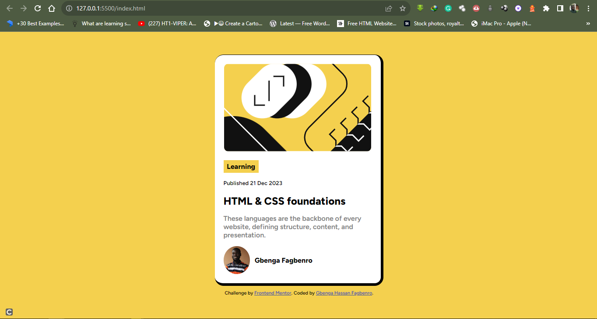
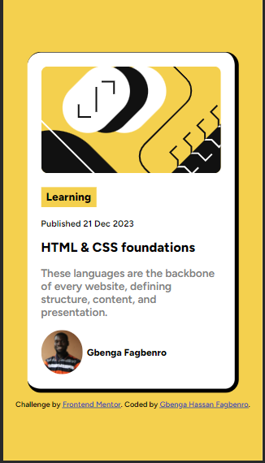

# Frontend Mentor - Blog preview card solution

This is a solution to the [Blog preview card challenge on Frontend Mentor](https://www.frontendmentor.io/challenges/blog-preview-card-ckPaj01IcS). Frontend Mentor challenges help you improve your coding skills by building realistic projects. 

## Table of contents

- [Overview](#overview)
  - [The challenge](#the-challenge)
  - [Screenshot](#screenshot)
  - [Links](#links)
- [My process](#my-process)
  - [Built with](#built-with)
  - [What I learned](#what-i-learned)
  - [Continued development](#continued-development)
- [Author](#author)

## Overview

### The challenge

Users should be able to:

- See hover and focus states for all interactive elements on the page

### Screenshot




Above are the screenshot of both Desktop and Mobile solution

### Links

- Solution URL: [Add solution URL here](https://www.frontendmentor.io/solutions/blogpreview-card-solution-using-html-and-css-only-ua4ddpJtu5)
- Live Site URL: [Add live site URL here](https://gbenga101.github.io/blog-card/)

## My process
I'm through with this project

### Built with

- Semantic HTML5 markup
- CSS custom properties
- Flexbox

### What I learned

I basically used css flexbox for everything, it makes my work easier and responsive. I also love the fact that without using javaScript I can still create small animations on css makes it fun. Below are examples


```html
<div class="attribution">
    Challenge by <a href="https://www.frontendmentor.io?ref=challenge" target="_blank">Frontend Mentor</a>. 
    Coded by <a href="https://twitter.com/FagbenroGbengaH">Gbenga Hassan Fagbenro</a>.
  </div>
```
```css
.botton:hover{
    transform: rotate(5deg);
  }
```
```css
.container{
    background-color: hsl(0, 0%, 100%);
    border-radius: 20px;
    display: flex;
    flex-direction: column;
    align-items: center;
    border-top: 1px solid;
    border-right: 6px solid;
    border-bottom: 6px solid;
}
```

### Continued development

First of all, I need to dedicate time (daily) to keep practicing and working on HTML and CSS projects. After mastering css flexbox and Grid by building enough project with them, I'll be adding javaScript to make my project looks lively

## Author

- LinkedIn - [@gbengafagbero] (https://www.linkedin.com/in/gbenga-fagbenro)
- GitHub - [@gbenga101](https://github.com/gbenga101)
- Frontend Mentor - [@gbenga101](https://www.frontendmentor.io/profile/gbenga101)
- Twitter - [@gbengafagbenro](https://www.twitter.com/FagbenroGbengaH)


